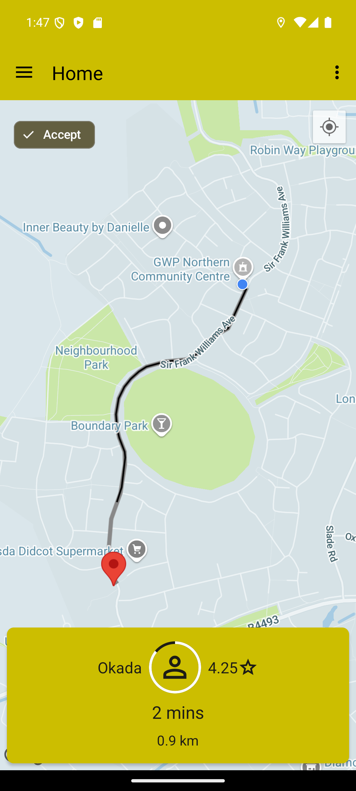
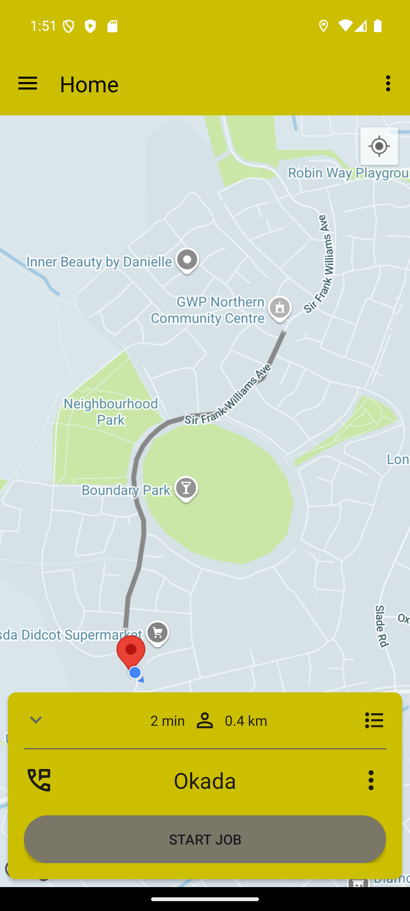
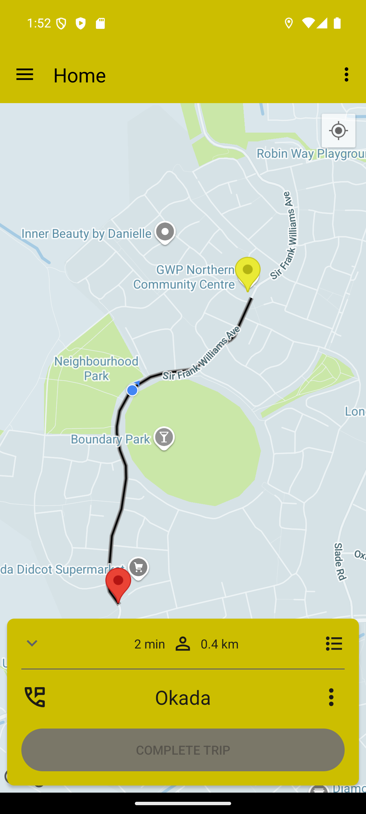

# Delivery Driver App

This is the **Delivery Driver** side of a biker pickup and delivery system built using **Kotlin** and **Firebase**. It allows drivers to receive, accept, and complete delivery tasks assigned through the customer app or backend service.

## Features

- **Authentication** for delivery drivers
- **Real-time location tracking** (Google Maps)
- **View and accept delivery tasks**
- **MVVM** + **Services**

## 📸 Screenshots

| Job arrival | On-route to Pickup | Start Job | On-route to Drop-off |
|-------|-----------|----------|----------|
|  |  |  | 
